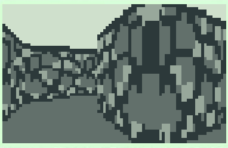

# maze-explore-Ti89
Explore inside a maze on a Ti89

(Note: The flickering in the demo above is due to an artifact of the emulator. On an actual calculator, there is no flickering and things look smoother.)

## Dependencies
  - [extgraph](https://github.com/debrouxl/ExtGraph)

## Compilation with GCC4TI
Run `tigcc maze.c extgraph.a -O3 -o maze`.

## Controls
  - Up/Down: move forwards or backwards
  - Left/Right: look left or right
  - Mode: Look at map
    - Press any arrow key to return to 3D view
  - Esc: Exit
